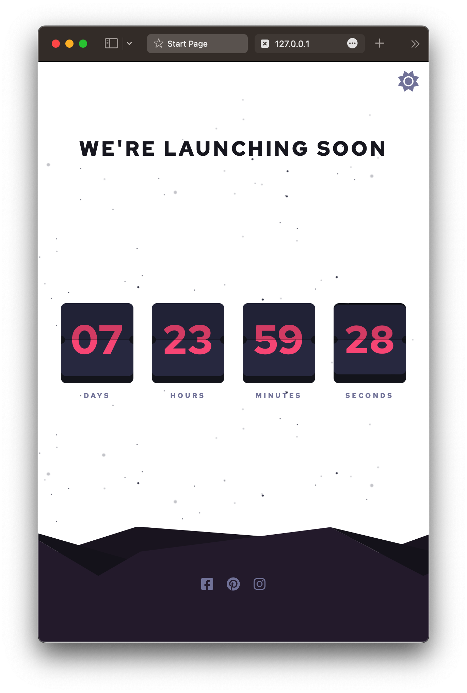
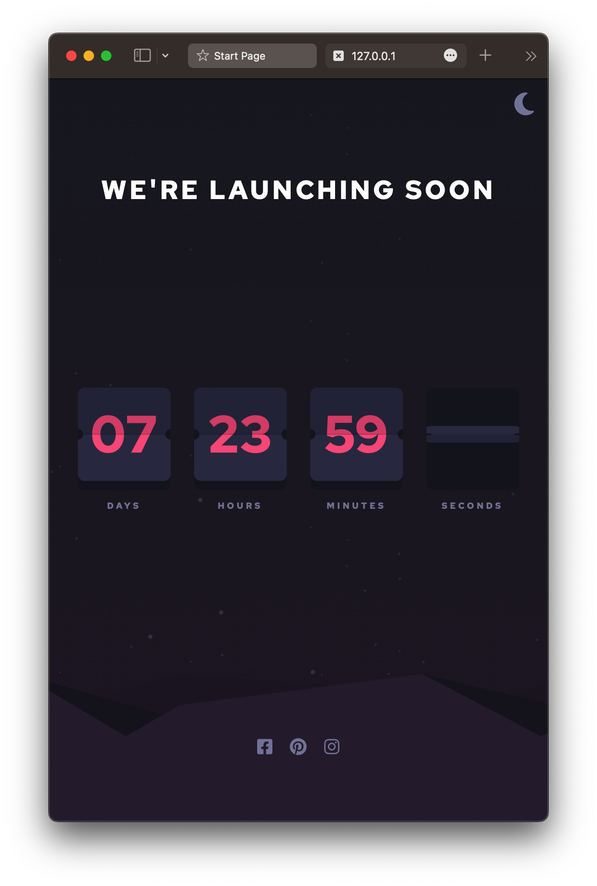
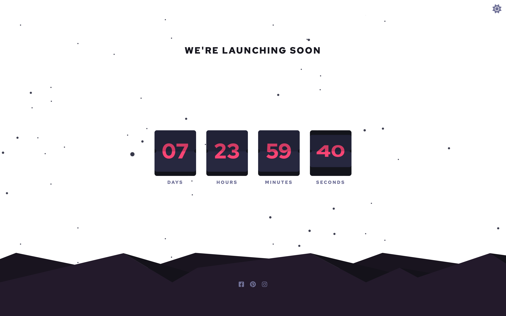
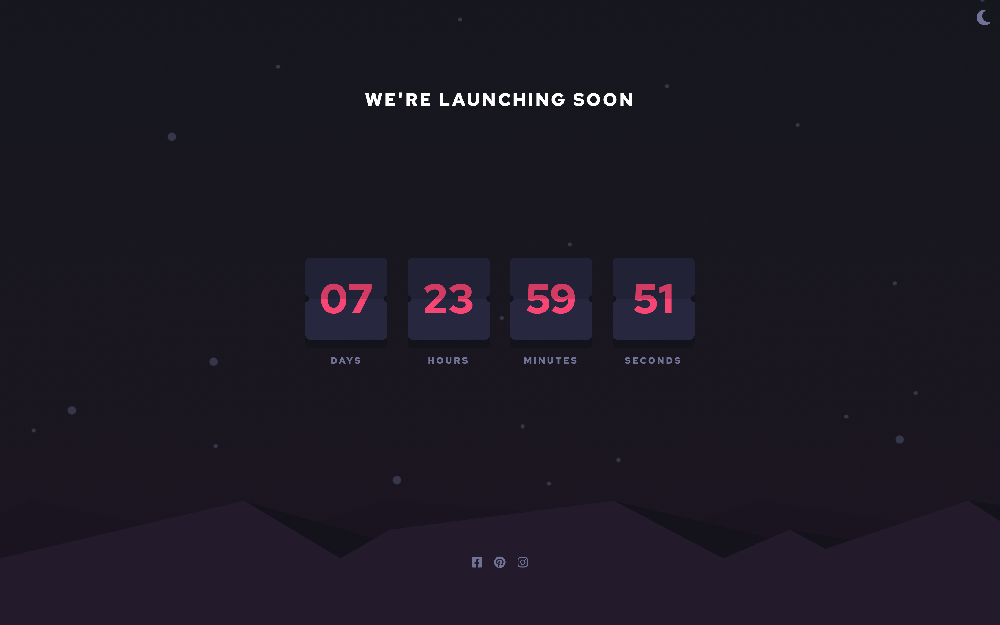

## Live

You can check out the live version of the project here -> [https://vladislav-gorovenko.github.io/challenge-11-countdown-timer/](https://vladislav-gorovenko.github.io/challenge-11-countdown-timer/).

# Launch Countdown Web App

Welcome to my Launch Countdown Web App repository. This project is a solution to the Launch Countdown Web App challenge on [Frontend Mentor](https://www.frontendmentor.io).

## The Challenge

The challenge involved building an application that allowed users to:

- See hover states for all interactive elements on the page
- See a live countdown timer that ticks down every second (start the count at 14 days)
- **Bonus**: When a number changes, make the card flip from the middle

## Technologies Used

This project was built using the following technologies:

- HTML
- SASS (BEM approach)
- JS

## Screenshots

## Contact Me

For any inquiries or feedback, feel free to get in touch with me through:

- [GitHub](https://github.com/vladislav-gorovenko)
- [LinkedIn](https://www.linkedin.com/in/vladislav-gorovenko-web/)
- [FrontendMentor](https://www.frontendmentor.io/profile/martinideniam/)
- [Telegram](https://t.me/vlad_webdev_iam)

## Feedback

If you have any feedback or suggestions, please open an issue here on [GitHub](https://github.com/vladislav-gorovenko/challenge-11-countdown-timer/issues).
